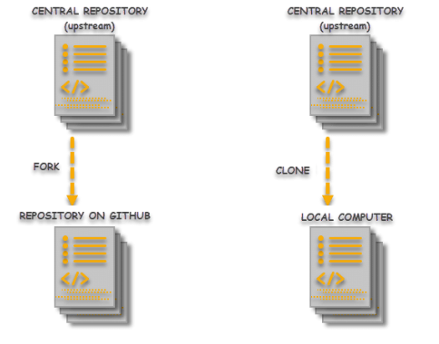
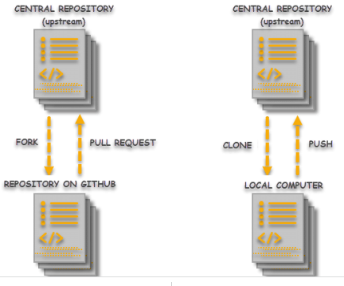
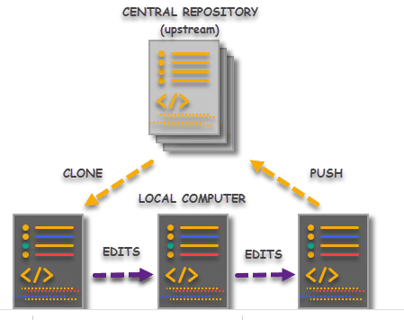
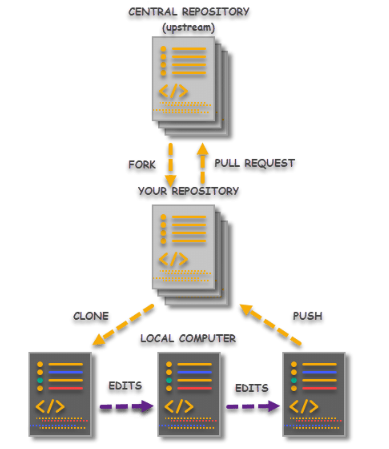

# Différence entre Git Clone et Git Fork

Puisque vous devez d'abord forker avant le clonage, bien que le fork 
ne soit pas une étape préalable stricte pour le clonage. 

Les personnes d'une organisation travaillant sur un dépot (référentiel) ne forkent généralement pas le dépot. 

Nous avons créé ce didacticiel uniquement pour nous concentrer sur la différence 

et vous expliquer clairement ces deux concepts, à savoir : Git Cloning et Git Forking. 

Ce tutoriel vous aidera à comprendre :

. Différence entre clonage et fork
. Workflow de fork et de clonage sur GitHub
. Pourquoi le clonage et le forking sont-ils utilisés de manière interchangeable ?

## Quelles sont les principales différences entre le forking et le clonage ?

Le **forking** est effectué sur le **compte GitHub** tandis que le **clonage** est effectué à l'aide de **Git**. 

Lorsque vous forker un dépot, vous créez une copie du dépot d'origine (référentiel en amont)
mais le dépot reste sur votre compte GitHub. 

Alors que, lorsque vous clonez un dépot, le dépot est copié sur votre machine locale à l'aide de Git.

Les modifications apportées au dépot dupliqué peuvent être fusionnées avec le dépot d'origine via une demande  **pull request**. 

La demande depull request frappe le propriétaire du dépot et indique que " J'ai apporté des modifications, veuillez fusionner ces modifications dans votre référentiel si vous l'aimez". 

D'autre part, les modifications effectuées sur la machine locale (dépôt cloné) peuvent être **poussées** directement 

vers le dépôt amont. Pour cela, l'utilisateur doit avoir l'accès en écriture au dépôt sinon ce n'est pas possible. 
Si l'utilisateur n'ont pas un accès en écriture, la seule façon de passer est par la requête forkée.

Ainsi, dans ce cas, les modifications apportées dans le dépot cloné sont d'abord poussées vers le dépot forké,
puis une demande pull request est créée.
 
 C'est une meilleure option de forker avant clone si l'utilisateur n'est pas déclaré comme contributeur et qu'il s'agit d'un référentiel tiers (non de l'organisation).

Le forking est un concept tandis que le clonage est un processus.
Le forking ne contient qu'une copie séparée du référentiel et aucune commande n'est impliquée. 
Le clonage se fait via la commande ' git clone ' 
et c'est un processus de réception de tous les fichiers de code sur la machine locale.

# Processus de flux avec fork et clone dans GitHub

Le processus de fork et de clonage suit généralement la route suivante :

## Cloner un dépôt Git sans fork

Étape 1 : Cloner un dépot : 
disposer de la copie exacte des fichiers du projet sur le système pour effectuer des modifications.

Etape 2 : Effectuez les modifications souhaitées :
un contributeur peut appliquer un seul commit ou plusieurs commits au dépot. 
Mais l'essentiel est que tout se passe sur le système local.

Étape 3 : pousser les modifications
une fois les modifications ou les validations effectuées, 
les modifications peuvent maintenant être poussées vers le dépot en amont.

## Cloner un dépôt Git après un fork

Forker un dépot est un processus en cinq étapes, mais trois étapes sont exactement les mêmes que le clonage. 
Seules la première et la dernière étape de fork diffèrent du clonage.

Étape 1 : Forker un dépot : 'utilisateur démarre à partir du dépot en amont sur GitHub, 
mais ce processus commence à partir du fork lorsqu'il fork un dépot vers son propre compte GitHub.

Étape 2 : Cloner un dépot : Identique au clonage.

Étape 3 : Effectuez les modifications souhaitées : Identique au clonage.

Étape 4 : pousser les changements : Identique au clonage.

Étape 5 : Envoyer les modifications au dépot d'origine : Ce processus est appelé Pull Request dans Git. 
À cette étape, l'utilisateur envoie les modifications au propriétaire du dépot 
sous la forme d'une demande de fusion des modifications vers le dépot central principal.

