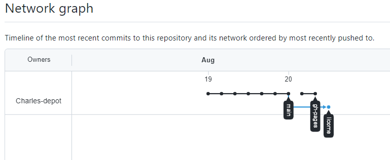
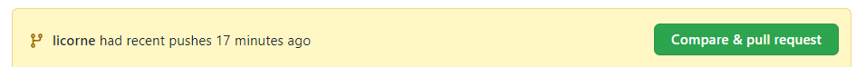
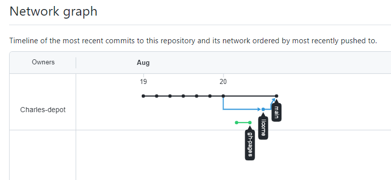
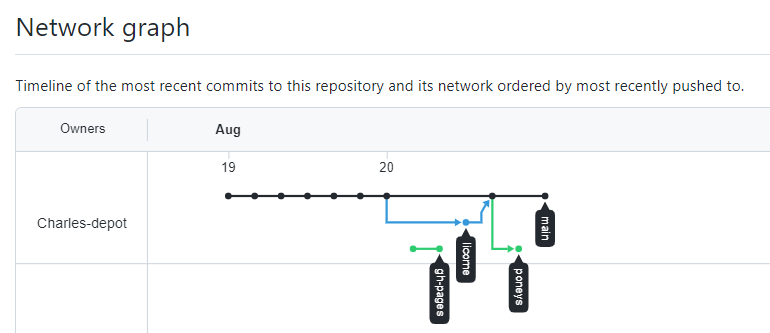
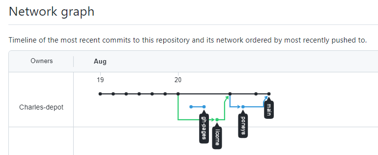

1.1: Introduction - Git et GitHub pour les poètes

https://www.youtube.com/watch?v=BCQHnlnPusY&list=PLRqwX-V7Uu6ZF9C0YMKuns9sLDzK6zoiV

Pourquoi Git et GitHub ?
. Version control 
. Collaboration

Git
Version control software 

GitHub
web service

**Repository**
Créer un compte sur Github
Créer un dépot 
Créer un new file de nom poemes.txt

**Commit new file**  ( Commit directly to the main branch)
Le poeme est dans le dépot. 

**Commmit change**
Cliquer sur poeme.txt
Il manque la couleur verte.
Cliquer sur le crayon --> Edit this file
Remplir en bas "Commit change" par "j'ai ajouté la couleur verte" puis cliquer sur "Commit changes"

Il manque la couleur jaune.
Cliquer sur le crayon --> Edit this file
Remplir en bas "Commit change" par "j'ai ajouté la couleur jaune" puis cliquer sur "Commit changes"

**Bilan :**
Création d'un dépot.
Plusieurs commit

Nous allons pouvoir voir l'historique
Cliquer sur **History** pour voir l'historique.
En cliquant sur un des commit, on peut voir ce qui a été modifié (solugné, biffer)
On voit aussi "commit d8f911b0c32226239ff7bb95e40306014b6386be" commit hash meaning, identifiant unique du commit
On le voit aussi dans l'URL https://github.com/Charles-depot/rainbow/commit/d8f911b0c32226239ff7bb95e40306014b6386be

1.2: Branches - Git and GitHub for Poets

Repository Poemes

J'ai effectué des commit de façon linéaire en apportant 
des modifications. Chaque commit possède un identifiant unique.
C'est la branche "master ou main". C'est la racine de notre arbre.

Je souhaite maintenant faire des modifications mais je ne sais pas si 
je vais les garder. Je souhaite faire une expérience sur mon poème qui va
parler de licornes.
Je souhaite bifurquer (branch) à partir d'un commit en créant une nouvelle branche.

Vous pouvez toujours continuer à travailler sur la branche master.
Vous pouvez faire des commit sur la nouvelle branche.
Vous pouvez aussi faire une autre branches "fées" à partir d'un autre commit.
Etc...

Et comment peut-on fusionner (merge) tout cela.

Créer la nouvelle branche "licorne" 
Vérifier que vous êtes bien sur la branche "licorne"
Modifier le poème en ajoutant des mots.
Ensuite on a le choix :

 Commit directly to the licorne branch.
 Create a new branch for this commit and start a pull request
 
 On choisit Commit directly to the licorne branch. Et on sauvegarde.
 
 Si on switch sur la branche main, on voit le poème l'ancienne version.
 On aurait pu faire un commit à partir de la branche main mais on a choisit
 de faire un chemin différent. On a deux chemins que l'on peut travailler séparément.
 
 Maintenant si je trouve que le chemin licorne est valable et je souhaite que ce travail aille
 dans la branche "main"
 Revenir dans le dépot "rainbow" puis Insights puis Network.
 Cela permet de visualiser les différents branches.
 
 
 push : pousser (envoyer) quelque chose à quelqu'un 
 pull : tirer quelque chose	à quelqu'un
 
 pull request : prendre les changments et les tirer vers la branche master
 merge
 
 Je retourne sur la branche "main" pour voir :
 
 
 Cliquer sur le bouton : Compare & pull request
 Je suis en train de faire un pull request cad
 une requète pour fusionner les changements faits de "licorne"
 à "main".
 On peut voir les changements en bas de page.
 Cliquer sur le bouton "create pull request"
 
 Cliquer sur le bouton "Merge pull request" pour finaliser. Puis "Confirm merge"

 Revenir dans le dépot "rainbow" puis Insights puis Network.
 Cela permet de visualiser ce qui s'est passé.
 On peut voir que la branche licorne a fusionné avec la branch "main".
 
 
 Créer une nouvelle "poneys" à partir de main.
 Modifier le poème.
 Faire un commit

Revenir à la branche "main"
Faire un changement.
Faire un commit

Revenir dans le dépot "rainbow" puis Insights puis Network.
On peut voir les différents actions.

Commnent fusionner le tout.

Branche "main"
Cliquer sur le bouton : Compare & pull request
Cliquer sur le bouton "Merge pull request" pour finaliser. Puis "Confirm merge"

Revenir dans le dépot "rainbow" puis Insights puis Network.
On peut voir le résultat.

