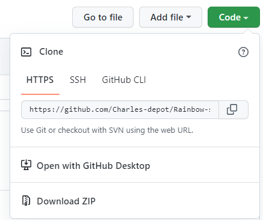
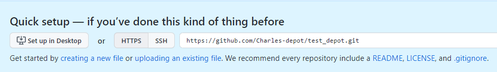
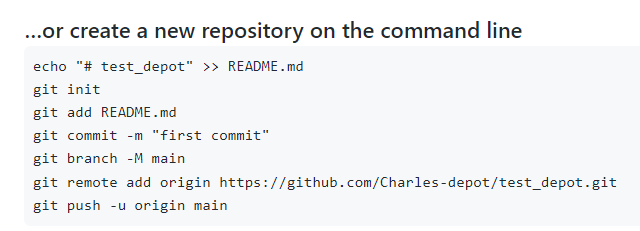
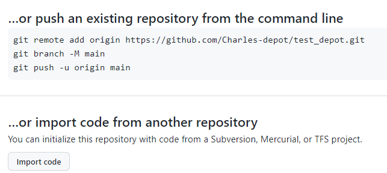
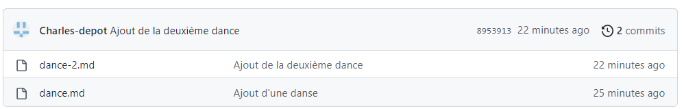
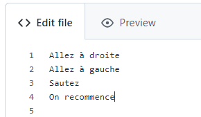
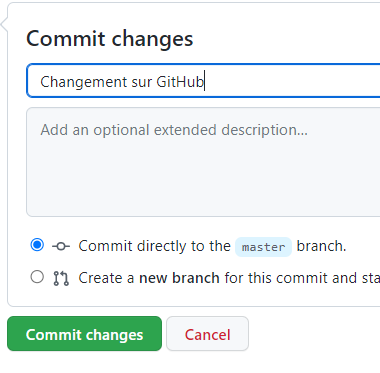
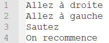

# Git et GitHub pour les poètes 

1.1: [Introduction](#git)

1.2: [Branches](#branche)

1.3- [Forks and Pull Requests](#fork)

1.4- [GitHub Issues](#issues)

1.5-[Introduction ligne de commande](#ligne)

1.6-[Cloner un dépot et Push-Pull](#clone)

1.7-[Git init and git add](#remote)

# 1.1: Introduction - Git et GitHub pour les poètes <a name="git"></a>

https://www.youtube.com/watch?v=BCQHnlnPusY&list=PLRqwX-V7Uu6ZF9C0YMKuns9sLDzK6zoiV

Pourquoi Git et GitHub ?
. Version control 
. Collaboration

Git
Version control software 

GitHub
web service

**Repository**
Créer un compte sur Github
Créer un dépot 
Créer un new file de nom poemes.txt

**Commit new file**  ( Commit directly to the main branch)
Le poeme est dans le dépot. 

**Commmit change**
Cliquer sur poeme.txt
Il manque la couleur verte.
Cliquer sur le crayon --> Edit this file
Remplir en bas "Commit change" par "j'ai ajouté la couleur verte" puis cliquer sur "Commit changes"

Il manque la couleur jaune.
Cliquer sur le crayon --> Edit this file
Remplir en bas "Commit change" par "j'ai ajouté la couleur jaune" puis cliquer sur "Commit changes"

**Bilan :**
Création d'un dépot.
Plusieurs commit

Nous allons pouvoir voir l'historique
Cliquer sur **History** pour voir l'historique.
En cliquant sur un des commit, on peut voir ce qui a été modifié (solugné, biffer)
On voit aussi "commit d8f911b0c32226239ff7bb95e40306014b6386be" commit hash meaning, identifiant unique du commit
On le voit aussi dans l'URL https://github.com/Charles-depot/rainbow/commit/d8f911b0c32226239ff7bb95e40306014b6386be

# 1.2: Branches - Git and GitHub for Poets <a name="branche"></a>

Repository Poemes

J'ai effectué des commit de façon linéaire en apportant 
des modifications. Chaque commit possède un identifiant unique.
C'est la branche "master ou main". C'est la racine de notre arbre.

Je souhaite maintenant faire des modifications mais je ne sais pas si 
je vais les garder. Je souhaite faire une expérience sur mon poème qui va
parler de licornes.
Je souhaite bifurquer (branch) à partir d'un commit en créant une nouvelle branche.

Vous pouvez toujours continuer à travailler sur la branche master.
Vous pouvez faire des commit sur la nouvelle branche.
Vous pouvez aussi faire une autre branches "fées" à partir d'un autre commit.
Etc...

Et comment peut-on fusionner (merge) tout cela.


Créer la nouvelle branche "licorne" 
Vérifier que vous êtes bien sur la branche "licorne"
Modifier le poème en ajoutant des mots.
Ensuite on a le choix :

 Commit directly to the licorne branch.
 Create a new branch for this commit and start a pull request
 
 On choisit Commit directly to the licorne branch. Et on sauvegarde.
 
 Si on switch sur la branche main, on voit le poème l'ancienne version.
 On aurait pu faire un commit à partir de la branche main mais on a choisit
 de faire un chemin différent. On a deux chemins que l'on peut travailler séparément.
 
 Maintenant si je trouve que le chemin licorne est valable et je souhaite que ce travail aille
 dans la branche "main"
 Revenir dans le dépot "rainbow" puis Insights puis Network.
 Cela permet de visualiser les différents branches.
 
 
 push : pousser (envoyer) quelque chose à quelqu'un 
 pull : tirer quelque chose	à quelqu'un
 
 pull request : prendre les changements et les tirer vers la branche master
 merge
 
 Je retourne sur la branche "main" pour voir :
 
 
 Cliquer sur le bouton : Compare & pull request
 Je suis en train de faire un pull request cad
 une requète pour fusionner les changements faits de "licorne"
 à "main".
 On peut voir les changements en bas de page.
 Cliquer sur le bouton "create pull request"
 
 Cliquer sur le bouton "Merge pull request" pour finaliser. Puis "Confirm merge"

 Revenir dans le dépot "rainbow" puis Insights puis Network.
 Cela permet de visualiser ce qui s'est passé.
 On peut voir que la branche licorne a fusionné avec la branch "main".
 
 
 Créer une nouvelle "poneys" à partir de main.
 Modifier le poème.
 Faire un commit

Revenir à la branche "main"
Faire un changement.
Faire un commit

Revenir dans le dépot "rainbow" puis Insights puis Network.
On peut voir les différents actions.


Commnent fusionner le tout.

Branche "main"
Cliquer sur le bouton : Compare & pull request
Cliquer sur le bouton "Merge pull request" pour finaliser. Puis "Confirm merge"

Revenir dans le dépot "rainbow" puis Insights puis Network.
On peut voir le résultat.


# 1.3- Forks and Pull Requests - Git and GitHub for Poets <a name="fork"></a>

Nous allons voir comment une autre personne et vous peuvent contribuer/collaborer
au dépot.

Deux concepts à ajouter.

Fork

une instance compléte de mon dépot sur un autre compte
On aura une exacte réplication du dépot avec les commit et les branches.
Je peux travailler sur le fork (commit, branches) sans modifier le dépot original.


Pull request

Cela signifie que par exemple si une branche de mon travail sur le fork est superbe
et que je souhaite contribuer dans le dépot original. 
Je vais envoyer ce travail dans le dépot original.
Et c'est au dépot original d'accepter ou rejeter d'où le pull request.


Actions

Aller sur charlestuteur, chercher charles-depot puis fork.
On peut le voir sur ce compte d'où provient le fork :


Modifier le poeme
Faire un commit en choisissant *Create a new branch for this commit and start a pull request.*
On peut aussi faire juste un commit
Ensuite faire un pull request pour ajouter à la brancher master du fork
Verifier sur Insights/Network

Créer un pull request vers charles-depot.
Et attendre la réponse.

Aller sur charles-depot et cliquer sur *Pull requests*


En cliquant sur la demande on peut voir les changements


Remplir le commentaire
Cliquer sur *Merge pull requests*

Aller sur charlestuteur pour voir la péponse.

# 1.4- GitHub Issues <a name="issues"></a>

Vous pouvez utiliser GitHub Issues pour planifier pour suivre les idées, les commentaires, les tâches 
ou les bogues et suivre votre travail.

Cliquer sur *New Issue* pour créer un nouveau problème.

Remplir les informations

Donner à votre problème un titre descriptif. Le titre doit indiquer en un coup d'œil de quoi il s'agit.
Ajoutez une description qui explique le but du problème, y compris tous les détails qui pourraient aider à résoudre le problème. 

Vous pouvez utiliser Markdown pour ajouter une mise en forme, des liens, des emojis, etc. 
Pour plus d'informations, consultez [« Écrire sur GitHub »](https://docs.github.com/en/get-started/writing-on-github/getting-started-with-writing-and-formatting-on-github/basic-writing-and-formatting-syntax)

**Ajouter une liste de tâches.**
- [] #50
- [] faire les modifications

**Ajouter des étiquettes (labels)**
Ajouter une étiquette pour catégoriser votre problème. 
GitHub fournit des étiquettes par défaut.

Vous pouvez utiliser ces libellés par défaut ou créer les votres.

Cliquer sur *issues* puis *Labels* puis *New label*.
Donner un nom, une description et une couleur.
[Etiquettes](https://docs.github.com/en/issues/using-labels-and-milestones-to-track-work/managing-labels)

**Associer les issues au commit ou au pull request ?**
Créer un commit et associer dans le titre le numéro de l'issue comme  ... per #8 
On crée un commit particulier à cette issue.
En revenant sur les issues :
Charles-depot added a commit that referenced this issue 1 minute ago


On peut cliquer sur commit lié per #8 pour suivre les changements.

Je peux ensuite clore l'issue. 

ou directement dans le commit en écrivant dans le titre fixes #8

On peut faire une issue à partir d'un commit.

commit 21f9ba806f57fd947586de3517a469fe41af2157


## Bilan
référence au numéro de l'issue

référence à l'identifiant d'un commit ou description de l'issue.

# 1.5: Introduction ligne de commande <a name="ligne"></a>

RAS

# 1.6: Cloner un dépot et Push-Pull <a name="clone"></a>

1.6- Cloning Repo and Push/Pull

Pour l'instant nous avons travaillé directement sur Github website.

Nous allons travaillé maintenat sur l'ordinateur.

Il faut installer **Git** sur l'ordinateur (voir aussi les différents clients).

https://git-scm.com/

https://www.youtube.com/watch?v=225wkShIcc8

### GitHub Desktop
Client git : https://desktop.github.com/
 
aide  : https://docs.github.com/en/desktop

# Git

## Partie 1
Vérifier que l'installation a bien fonctionné en ouvrant un cmd.
Puis taper git. On obtient une aide.

Faire un dépot Git local. Il faut un dossier dans l'ordinateur qui soit un dépot Git.

On va saisir le dépot sur GitHub et le mettre en local.

On crée un nouveau dépot : rainbow-song avec un readme.md

On peut ensuite voir :


C'est une  URL spécial qui correspond à ce dépot. Nécéssaire pour cloner
le dépot créé sur un ordinateur local.
https://github.com/Charles-depot/Rainbow-song.git

NB : Git associe une URL distante à un nom, et votre dépot par défaut est généralement appelée origin.

https://docs.github.com/en/get-started/getting-started-with-git/about-remote-repositories

## Partie 2
Dans le dossier local

Soit cmd ou clique droit Git Bash Here


```
git clone https://github.com/Charles-depot/Rainbow-song.git
```
On obtient :


Dans le dossier local :


Vous pouvez ouvrir le fichier README.md local pour voir qu'il correspond
à celui de GitHub. Et le modifier. Le sauvegarder.

```
git status
```


Ce n'est donc pas le dépot Git. Je ne suis pas dans le bon dossier.


On voit que l'on est dans la branch *master*.
On peut voir qu'un fichier a été modifié. 

Quand on est sur GitHub, on édit et on sauvegarde qd on commit en m^me temps.

Pour l'instant, le fichier est modifié localement.

```
$ git commit -a -m "Ajout de la cle C"
```
-a tous les fichiers
-m commentaire

On obtient :


```
git config --list 
```
Cela permet d'avoir des renseignements sur la configuration locale.
Il y a pb avec le user.name. Il faut le modifier. Et prendre le user.name du dépot GitHub.

```
git config global user.name = "Charles-depot" 
```


Cependant rien n'a changé dans le GitHub.

```
git remote

>> origin 
```

```
$ git remote -v
origin  https://github.com/Charles-depot/Rainbow-song.git (fetch)
origin  https://github.com/Charles-depot/Rainbow-song.git (push)

```
donc 

```
git push origin master
```

Cela ne fonction pas.

```
git push origin main
```
*main* est nom de la branche dans le dépot.

On obtient :


Et sur le dépot GitHub, on  peut voir le changement.

# 1.7: Git init and git add <a name="remote"></a>

Dans les parties précédentes, nous avons créé un dépot puis on l'a 
mis dans l'ordinateur.

Nous allons lier un dossier local à un dépot Git

## Création d'un dossier local test_depot 
un fichier dance.md

Dans ce dossier: 

:::info
```
$ git status
fatal: not a git repository (or any of the parent directories): .git
```
:::

Nous allons en faire un dépot git.

:::info
```
$ git init
Initialized empty Git repository in E:/Git Mkdocs Markdown/Test_depot/.git/
```
:::

:::info
```
$ git status
On branch master

No commits yet

Untracked files:
  (use "git add <file>..." to include in what will be committed)
        dance.md

nothing added to commit but untracked files present (use "git add" to track)
```
:::

## Ajouter un nouveau fichier 

Création de dance-2.md

:::info
```
$ git status
On branch master

No commits yet

Untracked files:
  (use "git add <file>..." to include in what will be committed)
        dance-2.md
        dance.md

nothing added to commit but untracked files present (use "git add" to track)
```
:::

On ajoute le suivi sur le fichier dance.md
:::info
```
$ git add dance.md
```
:::

:::info
```
$ git status
On branch master

No commits yet

Changes to be committed:
  (use "git rm --cached <file>..." to unstage)
        new file:   dance.md

Untracked files:
  (use "git add <file>..." to include in what will be committed)
        dance-2.md
```
:::

On peut lire qu'il y a un fichier suivi *dance.md* et un fichier non suivi *dance-2.md*


Un petit *commit*
:::info
```
$ git commit -m "Ajout d'une danse"
[master (root-commit) 1c0d430] Ajout d'une danse
 1 file changed, 3 insertions(+)
 create mode 100644 dance.md
```
:::

:::info
```
$ git status
On branch master
Untracked files:
  (use "git add <file>..." to include in what will be committed)
        dance-2.md

nothing added to commit but untracked files present (use "git add" to track)
```
:::

Si on souhaite tout suivre, on utilise la commande *git add .*

:::info
```
$ git add .

$ git commit -m "Ajout de la deuxième dance"
[master 8953913] Ajout de la deuxième dance
 1 file changed, 3 insertions(+)
 create mode 100644 dance-2.md
 
$ git status
On branch master
nothing to commit, working tree clean
```
:::

## Mettre tout dans un dépot

:::info
```
$ git push master
fatal: The current branch master has no upstream branch.
To push the current branch and set the remote as upstream, use

    git push --set-upstream master master

$ git remote -v
```
:::

Le dépot Git vide existe mais il n'y a pas d'association avec le dossier local.







On peut voir la ligne
https://github.com/Charles-depot/test_depot.git
qui permet d'associer le dépot distant avec le dossier local

:::info
```
$ git remote add origin https://github.com/Charles-depot/test_depot.git

$ git remote
origin

$ git remote -v
origin  https://github.com/Charles-depot/test_depot.git (fetch)
origin  https://github.com/Charles-depot/test_depot.git (push)
```
:::

Le dépot distant se nomme *origin*


:::info
```
$ git push origin master
Enumerating objects: 5, done.
Counting objects: 100% (5/5), done.
Delta compression using up to 4 threads
Compressing objects: 100% (3/3), done.
Writing objects: 100% (5/5), 496 bytes | 248.00 KiB/s, done.
Total 5 (delta 0), reused 0 (delta 0), pack-reused 0
To https://github.com/Charles-depot/test_depot.git
 * [new branch]      master -> master

```
:::

Si on regarde maintenant dans le dépot distant.


On retrouve nos deux fichiers.

## Changement dans GitHub

Modification du fichier dance.md dans GitHub

Un petit commit


Que s'est-il passé en local ?
:::info
```
$ git status
On branch master
nothing to commit, working tree clean
```
:::

**Rien**

La solution avec un **git pull**.

:::info
```
$ git pull origin master
remote: Enumerating objects: 5, done.
remote: Counting objects: 100% (5/5), done.
remote: Compressing objects: 100% (3/3), done.
remote: Total 3 (delta 0), reused 0 (delta 0), pack-reused 0
Unpacking objects: 100% (3/3), 699 bytes | 2.00 KiB/s, done.
From https://github.com/Charles-depot/test_depot
 * branch            master     -> FETCH_HEAD
   8953913..41b7811  master     -> origin/master
Updating 8953913..41b7811
Fast-forward
 dance.md | 1 +
 1 file changed, 1 insertion(+)

```
:::

On ouvre le fichier en local. :tada:



